# Ordinary Least Squares in Statsmodels (OLS) - Lab

## Introduction

In the previous code along, we looked all the requirements for running an ols simple regression using statsmodels. We worked with a toy example to understand the process and all the necessary steps that must be performed. In this lab , we shall look at a slightly more complex example to study the impact of spendings in different advertising channels of total sales.

## Objectives

You will be able to:
* Set up an analytical question to be answered by regression analysis
* Study regression assumptions for real world datasets
* Visualize the results of regression analysis

## Let's get started

In this lab, we will work with the "Advertising Dataset" which is a very popular dataset for studying simple regression. [The dataset is available at Kaggle](https://www.kaggle.com/purbar/advertising-data), but we have already downloaded for you. It is available as "Advertising.csv". We shall use this dataset to ask ourselves a simple analytical question:

## The Question

Which advertising channel has a strong relationship with sales volume, and can be used to model and predict the sales. 

### Step 1: Read the dataset and inspect its columns and 5-point statistics


```python
# Load necessary libraries and import the data
import pandas as pd
import numpy as np
import matplotlib.pyplot as plt
import statsmodels.api as sm
from statsmodels.formula.api import ols
import scipy.stats as stats
import seaborn as sns
```


```python
# Check the columns and first few rows
df = pd.read_csv('Advertising.csv', index_col=0)
df.head()
```


<div>
<style scoped>
    .dataframe tbody tr th:only-of-type {
        vertical-align: middle;
    }

    .dataframe tbody tr th {
        vertical-align: top;
    }

    .dataframe thead th {
        text-align: right;
    }
</style>
<table border="1" class="dataframe">
  <thead>
    <tr style="text-align: right;">
      <th></th>
      <th>TV</th>
      <th>radio</th>
      <th>newspaper</th>
      <th>sales</th>
    </tr>
  </thead>
  <tbody>
    <tr>
      <th>1</th>
      <td>230.1</td>
      <td>37.8</td>
      <td>69.2</td>
      <td>22.1</td>
    </tr>
    <tr>
      <th>2</th>
      <td>44.5</td>
      <td>39.3</td>
      <td>45.1</td>
      <td>10.4</td>
    </tr>
    <tr>
      <th>3</th>
      <td>17.2</td>
      <td>45.9</td>
      <td>69.3</td>
      <td>9.3</td>
    </tr>
    <tr>
      <th>4</th>
      <td>151.5</td>
      <td>41.3</td>
      <td>58.5</td>
      <td>18.5</td>
    </tr>
    <tr>
      <th>5</th>
      <td>180.8</td>
      <td>10.8</td>
      <td>58.4</td>
      <td>12.9</td>
    </tr>
  </tbody>
</table>
</div>


```python
# Get the 5-point statistics for data 
df.describe()
```


<div>
<style scoped>
    .dataframe tbody tr th:only-of-type {
        vertical-align: middle;
    }

    .dataframe tbody tr th {
        vertical-align: top;
    }

    .dataframe thead th {
        text-align: right;
    }
</style>
<table border="1" class="dataframe">
  <thead>
    <tr style="text-align: right;">
      <th></th>
      <th>TV</th>
      <th>radio</th>
      <th>newspaper</th>
      <th>sales</th>
    </tr>
  </thead>
  <tbody>
    <tr>
      <th>count</th>
      <td>200.000000</td>
      <td>200.000000</td>
      <td>200.000000</td>
      <td>200.000000</td>
    </tr>
    <tr>
      <th>mean</th>
      <td>147.042500</td>
      <td>23.264000</td>
      <td>30.554000</td>
      <td>14.022500</td>
    </tr>
    <tr>
      <th>std</th>
      <td>85.854236</td>
      <td>14.846809</td>
      <td>21.778621</td>
      <td>5.217457</td>
    </tr>
    <tr>
      <th>min</th>
      <td>0.700000</td>
      <td>0.000000</td>
      <td>0.300000</td>
      <td>1.600000</td>
    </tr>
    <tr>
      <th>25%</th>
      <td>74.375000</td>
      <td>9.975000</td>
      <td>12.750000</td>
      <td>10.375000</td>
    </tr>
    <tr>
      <th>50%</th>
      <td>149.750000</td>
      <td>22.900000</td>
      <td>25.750000</td>
      <td>12.900000</td>
    </tr>
    <tr>
      <th>75%</th>
      <td>218.825000</td>
      <td>36.525000</td>
      <td>45.100000</td>
      <td>17.400000</td>
    </tr>
    <tr>
      <th>max</th>
      <td>296.400000</td>
      <td>49.600000</td>
      <td>114.000000</td>
      <td>27.000000</td>
    </tr>
  </tbody>
</table>
</div>


#### Describe the contents of this dataset
There are 200 observations, all numerical values, no missing values.
TV mean and mode are similar and likely normallly distributed since range is 300-0, Quantile range is 75-218. Radio 0-50 range, mean and mode similar but quantile suggests more towards lower end (may be some outliers in the higher range). Newspaper very much skewed lower, since 0-114 max, but mean and mode are 30, 25. and quantile range is 12-45. May need to be aware of those outliers. Sales also not too made. might be easier to plot it since comparing mean and modes and quantile ranges are close but not the same.


### Step 2: Plot histograms with kde overlay to check for the normality of the predictors


```python
plt.style.use('ggplot')
```


```python
sns.distplot(df['TV'], color='red', kde_kws={'color': 'blue'})
```

    /anaconda3/envs/learn-env/lib/python3.6/site-packages/scipy/stats/stats.py:1713: FutureWarning: Using a non-tuple sequence for multidimensional indexing is deprecated; use `arr[tuple(seq)]` instead of `arr[seq]`. In the future this will be interpreted as an array index, `arr[np.array(seq)]`, which will result either in an error or a different result.
      return np.add.reduce(sorted[indexer] * weights, axis=axis) / sumval


    <matplotlib.axes._subplots.AxesSubplot at 0x7fbe31c0bcf8>


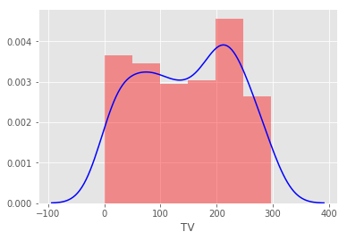


```python
sns.distplot(df['radio'], kde_kws={'color': 'blue'})
```

    /anaconda3/envs/learn-env/lib/python3.6/site-packages/scipy/stats/stats.py:1713: FutureWarning: Using a non-tuple sequence for multidimensional indexing is deprecated; use `arr[tuple(seq)]` instead of `arr[seq]`. In the future this will be interpreted as an array index, `arr[np.array(seq)]`, which will result either in an error or a different result.
      return np.add.reduce(sorted[indexer] * weights, axis=axis) / sumval


    <matplotlib.axes._subplots.AxesSubplot at 0x7fbdd0c99390>


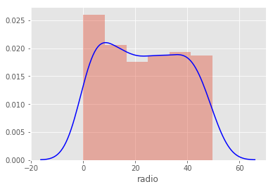


```python
sns.distplot(df['newspaper'], kde_kws={'color': 'blue'})
```

    /anaconda3/envs/learn-env/lib/python3.6/site-packages/scipy/stats/stats.py:1713: FutureWarning: Using a non-tuple sequence for multidimensional indexing is deprecated; use `arr[tuple(seq)]` instead of `arr[seq]`. In the future this will be interpreted as an array index, `arr[np.array(seq)]`, which will result either in an error or a different result.
      return np.add.reduce(sorted[indexer] * weights, axis=axis) / sumval


    <matplotlib.axes._subplots.AxesSubplot at 0x7fbe406734a8>


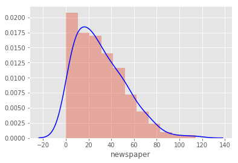


```python
sns.distplot(df['sales'], kde_kws={'color': 'blue'})
```


    ---------------------------------------------------------------------------

    NameError                                 Traceback (most recent call last)

    <ipython-input-2-8b71b6b830e2> in <module>()
    ----> 1 sns.distplot(df['sales'], kde_kws={'color': 'blue'})
    

    NameError: name 'sns' is not defined


#### Observations
As suspected, newspaper is very much skewed right (long tail at upper end) however they are not outliers it seems gradual enough. TV and Radio seem to have two peaks, but overall fairly normal


```python
# For all the variables, check if they hold normality assumption

```


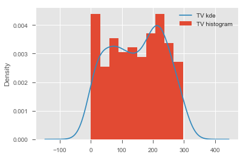


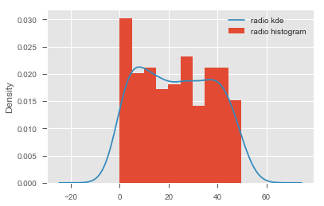


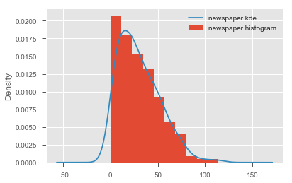


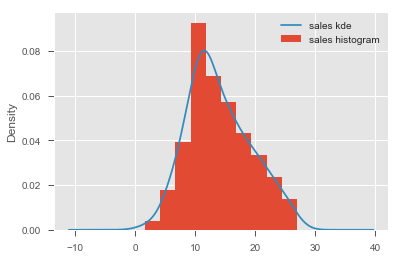


#### Remember . Nothing is perfect . So be positive 


### Step 3: Test for the linearity assumption. 
Use scatterplots to plot each predictor against the target variable


```python
fig = plt.figure(figsize=[15,5])
ax = fig.add_subplot(131)
ax.scatter(df['TV'], df['sales'], c='purple')
plt.ylabel('Sales')
ax.set_xlabel('TV')
ax1 = fig.add_subplot(132, sharey=ax)
ax1.scatter(df['radio'], df['sales'], c='purple')
ax1.set_xlabel('radio')
ax2 = fig.add_subplot(133, sharey=ax)
ax2.scatter(df['newspaper'], df['sales'], c='purple')
ax2.set_xlabel('newspaper')
plt.show()
```


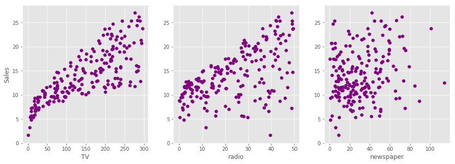


```python
# visualize the relationship between the preditors and the target using scatterplots

```

#### Record yor observations on linearity here 
TV looks somewhat lineary, higher ranges start to spread out. Some linear trend in radio but also varied. some high end on the radio scale has very low sales. Newspapers seems to be all over the place and not linear, perhaps not even correlated.


### Conclusion so far !

Based on above initial checks, we can confidently say that TV and radio appear to be good predictors for our regression analysis. Newspaper is very heavily skewed and also doesnt show any clear linear relationship with the target. 
> We shall move ahead with our analysis using TV and radio , and count out the newspaper due to the fact that data violates ols assumptions

Note: Kurtosis can be dealt with using techniques like log normalization to "push" the peak towards the center of distribution. We shall talk about this in the next section. 

### Step 4: Run a simple regression in `statsmodels` with TV as a predictor


```python
# import libraries

# build the formula 
f = 'sales~TV'

# create a fitted model in one line
model = ols(formula=f, data=df).fit()
```

### Step 5: Get regression diagnostics summary


```python
model.summary()
```


<table class="simpletable">
<caption>OLS Regression Results</caption>
<tr>
  <th>Dep. Variable:</th>          <td>sales</td>      <th>  R-squared:         </th> <td>   0.612</td>
</tr>
<tr>
  <th>Model:</th>                   <td>OLS</td>       <th>  Adj. R-squared:    </th> <td>   0.610</td>
</tr>
<tr>
  <th>Method:</th>             <td>Least Squares</td>  <th>  F-statistic:       </th> <td>   312.1</td>
</tr>
<tr>
  <th>Date:</th>             <td>Tue, 09 Jul 2019</td> <th>  Prob (F-statistic):</th> <td>1.47e-42</td>
</tr>
<tr>
  <th>Time:</th>                 <td>13:09:57</td>     <th>  Log-Likelihood:    </th> <td> -519.05</td>
</tr>
<tr>
  <th>No. Observations:</th>      <td>   200</td>      <th>  AIC:               </th> <td>   1042.</td>
</tr>
<tr>
  <th>Df Residuals:</th>          <td>   198</td>      <th>  BIC:               </th> <td>   1049.</td>
</tr>
<tr>
  <th>Df Model:</th>              <td>     1</td>      <th>                     </th>     <td> </td>   
</tr>
<tr>
  <th>Covariance Type:</th>      <td>nonrobust</td>    <th>                     </th>     <td> </td>   
</tr>
</table>
<table class="simpletable">
<tr>
      <td></td>         <th>coef</th>     <th>std err</th>      <th>t</th>      <th>P>|t|</th>  <th>[0.025</th>    <th>0.975]</th>  
</tr>
<tr>
  <th>Intercept</th> <td>    7.0326</td> <td>    0.458</td> <td>   15.360</td> <td> 0.000</td> <td>    6.130</td> <td>    7.935</td>
</tr>
<tr>
  <th>TV</th>        <td>    0.0475</td> <td>    0.003</td> <td>   17.668</td> <td> 0.000</td> <td>    0.042</td> <td>    0.053</td>
</tr>
</table>
<table class="simpletable">
<tr>
  <th>Omnibus:</th>       <td> 0.531</td> <th>  Durbin-Watson:     </th> <td>   1.935</td>
</tr>
<tr>
  <th>Prob(Omnibus):</th> <td> 0.767</td> <th>  Jarque-Bera (JB):  </th> <td>   0.669</td>
</tr>
<tr>
  <th>Skew:</th>          <td>-0.089</td> <th>  Prob(JB):          </th> <td>   0.716</td>
</tr>
<tr>
  <th>Kurtosis:</th>      <td> 2.779</td> <th>  Cond. No.          </th> <td>    338.</td>
</tr>
</table><br/><br/>Warnings:<br/>[1] Standard Errors assume that the covariance matrix of the errors is correctly specified.


### Record your observations on "Goodness of fit"

R-squared is above .5 but not very close to one. Seems like some of the data is explained but not all of it - matches what we see in the TV~sales plot. Std Error is around 10 which is quite large given the scale goes from 0-25. HOwever the p>|t| value is 0.002 so it is a significant coefficient and we can reject the null hypothesis (that TV has no effect on sales), TV ads does have an association on sales.


Note here that the coefficients represent associations, not causations


```python

```


<table class="simpletable">
<caption>OLS Regression Results</caption>
<tr>
  <th>Dep. Variable:</th>          <td>sales</td>      <th>  R-squared:         </th> <td>   0.612</td>
</tr>
<tr>
  <th>Model:</th>                   <td>OLS</td>       <th>  Adj. R-squared:    </th> <td>   0.610</td>
</tr>
<tr>
  <th>Method:</th>             <td>Least Squares</td>  <th>  F-statistic:       </th> <td>   312.1</td>
</tr>
<tr>
  <th>Date:</th>             <td>Fri, 12 Oct 2018</td> <th>  Prob (F-statistic):</th> <td>1.47e-42</td>
</tr>
<tr>
  <th>Time:</th>                 <td>21:04:59</td>     <th>  Log-Likelihood:    </th> <td> -519.05</td>
</tr>
<tr>
  <th>No. Observations:</th>      <td>   200</td>      <th>  AIC:               </th> <td>   1042.</td>
</tr>
<tr>
  <th>Df Residuals:</th>          <td>   198</td>      <th>  BIC:               </th> <td>   1049.</td>
</tr>
<tr>
  <th>Df Model:</th>              <td>     1</td>      <th>                     </th>     <td> </td>   
</tr>
<tr>
  <th>Covariance Type:</th>      <td>nonrobust</td>    <th>                     </th>     <td> </td>   
</tr>
</table>
<table class="simpletable">
<tr>
      <td></td>         <th>coef</th>     <th>std err</th>      <th>t</th>      <th>P>|t|</th>  <th>[0.025</th>    <th>0.975]</th>  
</tr>
<tr>
  <th>Intercept</th> <td>    7.0326</td> <td>    0.458</td> <td>   15.360</td> <td> 0.000</td> <td>    6.130</td> <td>    7.935</td>
</tr>
<tr>
  <th>TV</th>        <td>    0.0475</td> <td>    0.003</td> <td>   17.668</td> <td> 0.000</td> <td>    0.042</td> <td>    0.053</td>
</tr>
</table>
<table class="simpletable">
<tr>
  <th>Omnibus:</th>       <td> 0.531</td> <th>  Durbin-Watson:     </th> <td>   1.935</td>
</tr>
<tr>
  <th>Prob(Omnibus):</th> <td> 0.767</td> <th>  Jarque-Bera (JB):  </th> <td>   0.669</td>
</tr>
<tr>
  <th>Skew:</th>          <td>-0.089</td> <th>  Prob(JB):          </th> <td>   0.716</td>
</tr>
<tr>
  <th>Kurtosis:</th>      <td> 2.779</td> <th>  Cond. No.          </th> <td>    338.</td>
</tr>
</table>


### Step 6:  Draw a prediction line with data points omn a scatter plot for X (TV) and Y (Sales)

Hint: We can use `model.predict()` functions to predict the start and end point of of regression line for the minimum and maximum values in the 'TV' variable. 


```python
# create a DataFrame with the minimum and maximum values of TV

# make predictions for those x values and store them
min_max_df = pd.DataFrame(data={'TV': [df.TV.min(), df.TV.max()]})
min_max_df['Prediction'] = model.predict(min_max_df)
min_max_df                                
```


<div>
<style scoped>
    .dataframe tbody tr th:only-of-type {
        vertical-align: middle;
    }

    .dataframe tbody tr th {
        vertical-align: top;
    }

    .dataframe thead th {
        text-align: right;
    }
</style>
<table border="1" class="dataframe">
  <thead>
    <tr style="text-align: right;">
      <th></th>
      <th>TV</th>
      <th>Prediction</th>
    </tr>
  </thead>
  <tbody>
    <tr>
      <th>0</th>
      <td>0.7</td>
      <td>7.065869</td>
    </tr>
    <tr>
      <th>1</th>
      <td>296.4</td>
      <td>21.122454</td>
    </tr>
  </tbody>
</table>
</div>


```python
# first, plot the observed data and the least squares line
fig = plt.figure(figsize=[10,8])

```

          TV
    0    0.7
    1  296.4
    0     7.065869
    1    21.122454
    dtype: float64


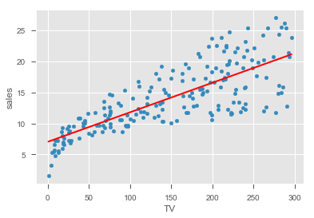


### Step 7: Visualize the error term for variance and heteroscedasticity


```python

```


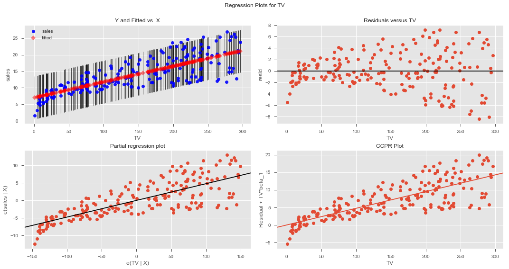


```python
# Record Your observations on residuals
```


### Next, repeat above for radio and go through the same process, recording your observations


```python

```

    R-Squared: 0.33203245544529525
    Intercept    9.311638
    radio        0.202496
    dtype: float64


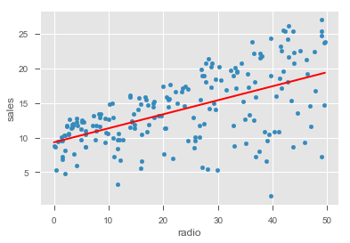


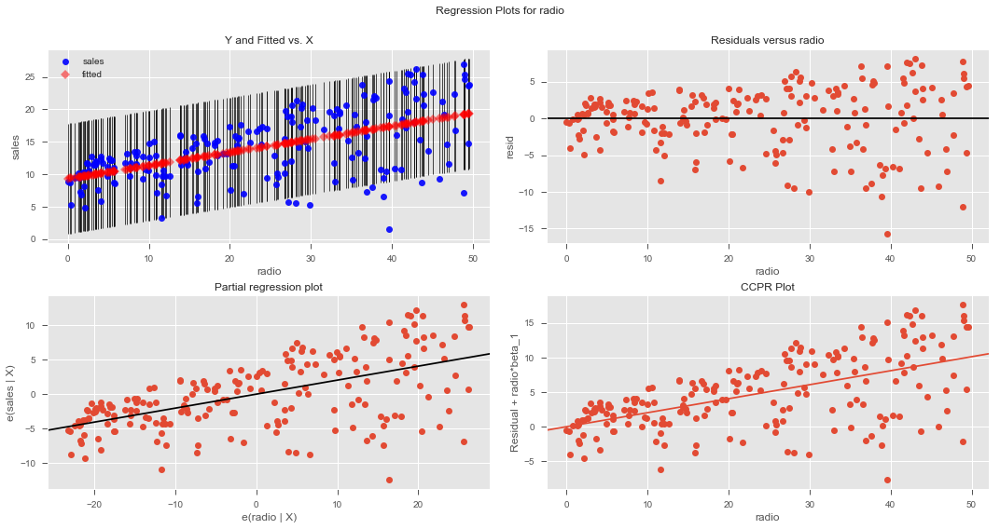


```python
model.summary()
```


<table class="simpletable">
<caption>OLS Regression Results</caption>
<tr>
  <th>Dep. Variable:</th>          <td>sales</td>      <th>  R-squared:         </th> <td>   0.332</td>
</tr>
<tr>
  <th>Model:</th>                   <td>OLS</td>       <th>  Adj. R-squared:    </th> <td>   0.329</td>
</tr>
<tr>
  <th>Method:</th>             <td>Least Squares</td>  <th>  F-statistic:       </th> <td>   98.42</td>
</tr>
<tr>
  <th>Date:</th>             <td>Fri, 12 Oct 2018</td> <th>  Prob (F-statistic):</th> <td>4.35e-19</td>
</tr>
<tr>
  <th>Time:</th>                 <td>20:52:55</td>     <th>  Log-Likelihood:    </th> <td> -573.34</td>
</tr>
<tr>
  <th>No. Observations:</th>      <td>   200</td>      <th>  AIC:               </th> <td>   1151.</td>
</tr>
<tr>
  <th>Df Residuals:</th>          <td>   198</td>      <th>  BIC:               </th> <td>   1157.</td>
</tr>
<tr>
  <th>Df Model:</th>              <td>     1</td>      <th>                     </th>     <td> </td>   
</tr>
<tr>
  <th>Covariance Type:</th>      <td>nonrobust</td>    <th>                     </th>     <td> </td>   
</tr>
</table>
<table class="simpletable">
<tr>
      <td></td>         <th>coef</th>     <th>std err</th>      <th>t</th>      <th>P>|t|</th>  <th>[0.025</th>    <th>0.975]</th>  
</tr>
<tr>
  <th>Intercept</th> <td>    9.3116</td> <td>    0.563</td> <td>   16.542</td> <td> 0.000</td> <td>    8.202</td> <td>   10.422</td>
</tr>
<tr>
  <th>radio</th>     <td>    0.2025</td> <td>    0.020</td> <td>    9.921</td> <td> 0.000</td> <td>    0.162</td> <td>    0.243</td>
</tr>
</table>
<table class="simpletable">
<tr>
  <th>Omnibus:</th>       <td>19.358</td> <th>  Durbin-Watson:     </th> <td>   1.946</td>
</tr>
<tr>
  <th>Prob(Omnibus):</th> <td> 0.000</td> <th>  Jarque-Bera (JB):  </th> <td>  21.910</td>
</tr>
<tr>
  <th>Skew:</th>          <td>-0.764</td> <th>  Prob(JB):          </th> <td>1.75e-05</td>
</tr>
<tr>
  <th>Kurtosis:</th>      <td> 3.544</td> <th>  Cond. No.          </th> <td>    51.4</td>
</tr>
</table>


```python
# Record your observations here for goodnes of fit 
```


## The Answer


Based on above analysis, we can conclude that none of the two chosen predictors is ideal for modeling a relationship with the sales volumes. `Newspaper` clearly violated normality and linearity assumptions. TV and radio did not provide a high value for co-efficient of determination - TV performed slightly better than the radio. There is obvious heteroscdasticity in the residuals for both variables. 

> We can either look for further data, perform extra pre-processing or use more advanced techniques. 

Remember there are lot of technqiues we can employ to FIX this data. 

Whether we should call TV the "best predictor" or label all of them "equally useless", is a domain specific question and a marketing manager would have a better opinion on how to move forward with this situation. 

In the following lesson, we shall look at the more details on interpreting the regression diagnostics and confidence in the model. 

## Summary

In this lesson, we ran a complete regression analysis with a simple dataset. We looked for the regression assumptions pre and post the analysis phase. We also created some visualizations to develop a confidence on the model and check for its goodness of fit. 
